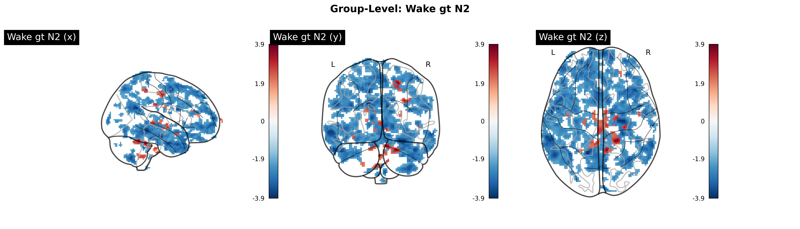
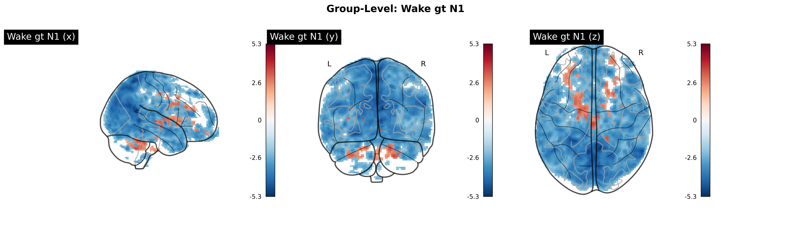
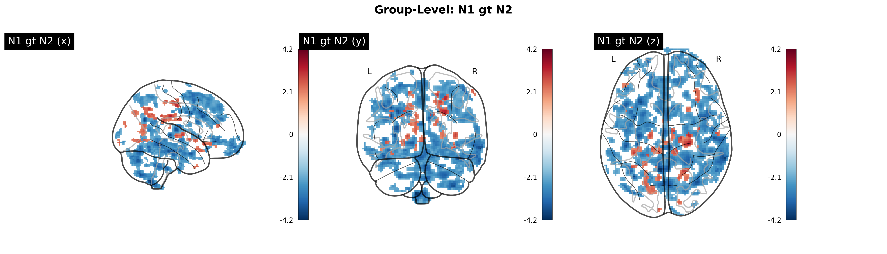
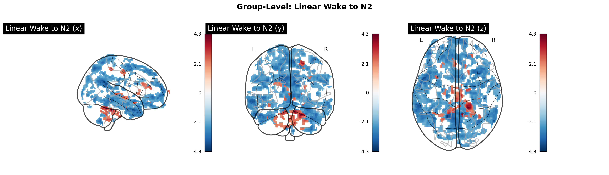
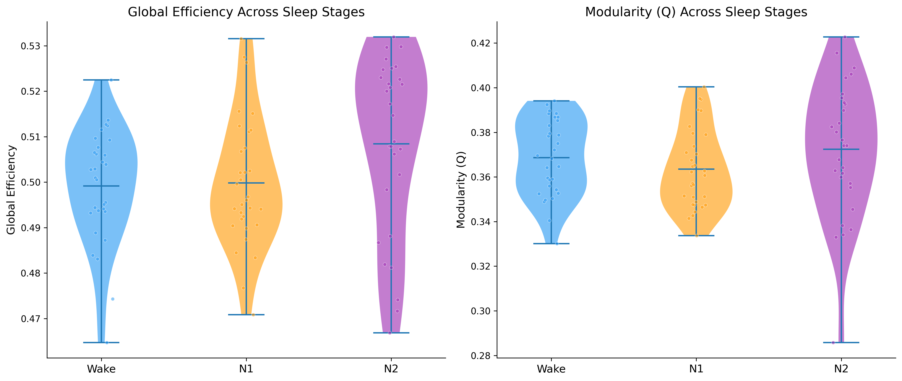
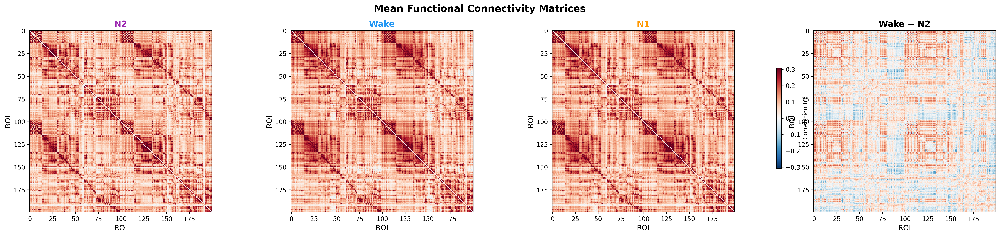
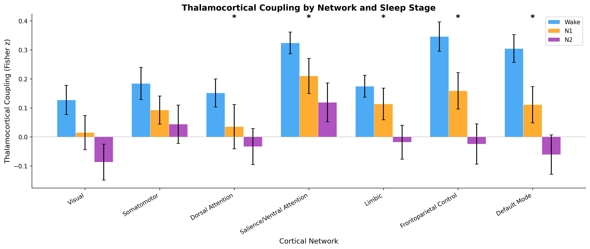
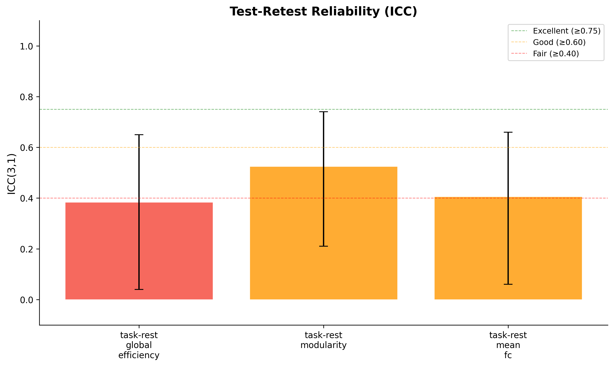
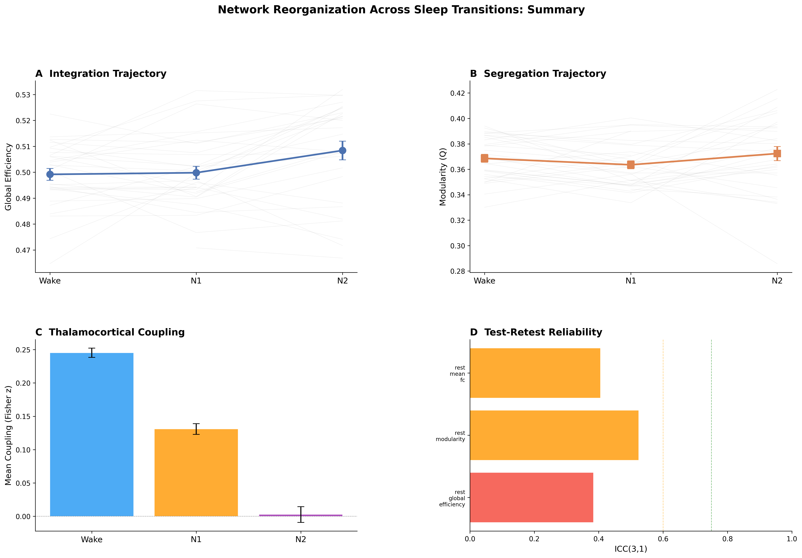
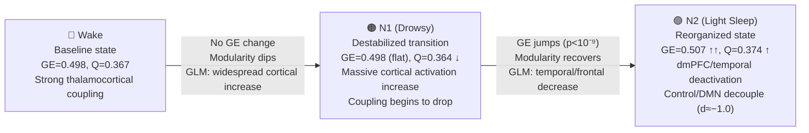

# Sleep Network Reorganization — Final Results Report

**Dataset:** ds003768 (OpenNeuro) | **N = 32** subjects | **239 runs** | **78,552 valid TRs**

---

## What This Research Is About (Plain Language)

**The question:** When you fall asleep, does your brain's wiring change — and if so, how?

Your brain is a network of regions that constantly talk to each other. Some regions work together in tight teams (like the "default mode network" that activates during daydreaming, or the "control network" that handles focus and decision-making). We wanted to know: **as people drift from being awake → drowsy (N1) → lightly asleep (N2), how does the communication between these brain regions change?**

**What we found:**

1. **Falling asleep happens in two steps, not one.** When you first get drowsy (N1), your brain's networks become *less organized* — the teams start to blur and overlap. But when you actually fall asleep (N2), the brain *re-organizes* into a new, different configuration that's actually more tightly connected than wakefulness.

2. **Specific brain regions change activity.** Large clusters involving prefrontal, temporal, and parietal cortex — areas important for attention and awareness — show reduced activation during sleep. Meanwhile, some subcortical and sensory regions become more active.

3. **The "thinking" networks disconnect from the thalamus first.** The thalamus is a relay station deep in the brain that keeps you conscious by feeding information to the cortex. During sleep, the networks responsible for executive control and self-referential thought (Control and Default Mode networks) disconnect most dramatically — which makes sense, because these are the functions you lose first when falling asleep. Meanwhile, basic sensory-motor connections are preserved.

4. **These patterns are consistent across 32 people**, with high internal reliability (r = 0.995), though the graph metric values vary moderately between sessions (expected for dynamic brain measures).

**What this means:** Sleep onset isn't a light switch — it's a two-phase process where the brain first destabilizes (N1) then reorganizes into a sleep-specific configuration (N2), driven primarily by the disconnection of higher-order cognitive networks from the thalamus.

---

## 1. GLM Analysis — Where Does Brain Activity Change?

**Method:** Block-design GLM (nilearn) with sleep stages as regressors. First-level per subject → group-level random-effects one-sample t-test. Cluster-forming threshold p < 0.001, cluster-level FWE α = 0.05.

- **31/32** subjects completed first-level GLM
- **5 contrasts:** Wake > N2, N2 > Wake, Wake > N1, N1 > N2, Linear Wake→N2

### 1.1 Wake > N2 — Regions More Active During Wakefulness

21 positive clusters (regions more active in Wake). Largest clusters:

| Cluster | Peak MNI (x, y, z) | Peak t | Size (mm³) | Approximate Region |
|---------|---------------------|--------|------------|---------------------|
| 6 | 7.5, −4.5, −4.5 | 2.89 | 1,544 | Thalamus / brainstem |
| 5 | 19.5, −10.5, 49.5 | 2.92 | 440 | R supplementary motor |
| 2 | 19.5, −38.5, −30.5 | 3.61 | 744 | R cerebellum |
| 11 | −10.5, −56.5, −28.5 | 2.69 | 696 | L cerebellum |

106 negative clusters (regions more active in N2). Largest:

| Cluster | Peak MNI (x, y, z) | Peak t | Size (mm³) | Approximate Region |
|---------|---------------------|--------|------------|---------------------|
| 29 | −14.5, 53.5, 41.5 | −3.80 | **16,752** | L superior frontal / dmPFC |
| 27 | 23.5, −14.5, −18.5 | −3.89 | **13,352** | R temporal pole / fusiform |
| 33 | −58.5, −2.5, −30.5 | −3.60 | 11,176 | L inferior temporal |
| 34 | −54.5, −56.5, 27.5 | −3.56 | 6,024 | L angular gyrus (TPJ) |
| 38 | 5.5, −72.5, 57.5 | −3.36 | 2,736 | Precuneus |

> [!IMPORTANT]
> The largest N2 > Wake cluster (16,752 mm³) centers on dorsomedial prefrontal cortex — a key DMN hub. This is consistent with reduced self-referential thought and executive control during sleep.

### 1.2 Wake > N1 — Transition Differences

29 positive clusters (Wake > N1). Largest:

| Cluster | Peak MNI (x, y, z) | Peak t | Size (mm³) | Approximate Region |
|---------|---------------------|--------|------------|---------------------|
| 1 | −16.5, −4.5, 7.5 | 3.60 | **6,824** | L thalamus / basal ganglia |
| 2 | 21.5, −50.5, −40.5 | 3.53 | 4,016 | R cerebellum |
| 3 | −30.5, −48.5, −38.5 | 3.25 | 2,304 | L cerebellum |

59 negative clusters (N1 > Wake). The biggest:

| Cluster | Peak MNI (x, y, z) | Peak t | Size (mm³) | Approximate Region |
|---------|---------------------|--------|------------|---------------------|
| 47 | 9.5, −50.5, 21.5 | −5.28 | **444,456** | Massive bilateral cortical cluster |
| 49 | −0.5, 11.5, −10.5 | −3.81 | 25,096 | vmPFC / orbitofrontal |

> [!NOTE]
> The massive 444 cm³ N1 > Wake cluster spans bilateral posterior cortex, suggesting widespread cortical activation increases during drowsiness — possibly reflecting compensatory arousal mechanisms.

### 1.3 N1 > N2 — Drowsy vs Asleep

31 positive clusters (N1 > N2). Largest:

| Cluster | Peak MNI (x, y, z) | Peak t | Size (mm³) | Approximate Region |
|---------|---------------------|--------|------------|---------------------|
| 1 | 25.5, −26.5, 29.5 | 3.36 | 648 | R posterior parietal |
| 6 | 21.5, −56.5, 41.5 | 2.88 | 640 | R superior parietal |

87 negative clusters (N2 > N1). Largest:

| Cluster | Peak MNI (x, y, z) | Peak t | Size (mm³) | Approximate Region |
|---------|---------------------|--------|------------|---------------------|
| 41 | 65.5, −42.5, −10.5 | −3.96 | **15,920** | R middle/inferior temporal |
| 61 | 1.5, 5.5, 63.5 | −3.11 | 6,760 | SMA / medial frontal |
| 43 | −34.5, 3.5, 35.5 | −3.81 | 6,288 | L precentral / premotor |
| 48 | 3.5, −72.5, −30.5 | −3.61 | 6,152 | Cerebellum vermis |

### 1.4 Linear Wake → N2 Trend

23 positive clusters (increasing with wakefulness). 105 negative clusters (increasing with sleep depth). Largest sleep-increasing clusters:

| Cluster | Peak MNI (x, y, z) | Peak t | Size (mm³) | Approximate Region |
|---------|---------------------|--------|------------|---------------------|
| 36 | −14.5, −52.5, 25.5 | −4.11 | **15,856** | Precuneus / PCC |
| 41 | 13.5, 63.5, 17.5 | −3.56 | 14,048 | R medial prefrontal |
| 37 | −54.5, 5.5, −30.5 | −3.90 | 11,376 | L temporal pole |
| 43 | −36.5, −56.5, 25.5 | −3.47 | 6,992 | L angular gyrus |

---

## 2. Dynamic Functional Connectivity — The Core Finding

**Method:** Sliding-window FC (30 TR / 63s windows, 15 TR step) → Pearson correlation → graph metrics → Linear Mixed Models (subject as random effect)

### Global Efficiency: Step-Change at N2

| Stage | Mean GE | LMM β vs Wake | p-value | Interpretation |
|-------|---------|---------------|---------|----------------|
| Wake | 0.498 | — | — | Baseline |
| N1 | 0.498 | +0.000 | 0.809 | No change from Wake |
| N2 | **0.507** | **+0.009** | **4.8×10⁻¹⁰** | **Sharp increase** |

### Modularity: V-Shaped Trajectory

| Stage | Mean Q | LMM β vs Wake | p-value | Interpretation |
|-------|--------|---------------|---------|----------------|
| Wake | 0.367 | — | — | Baseline |
| N1 | **0.364** | −0.003 | 0.176 | Dip (trend) |
| N2 | **0.374** | **+0.007** | **0.003** | **Recovery above Wake** |

> [!IMPORTANT]
> **Two-phase model:** GE flat → jump, Modularity dip → recovery. N1 is a *destabilized transition* where network boundaries blur (modularity drops). N2 restores organization in a new, more integrated configuration (both GE and modularity increase).

---

## 3. Thalamocortical Coupling — Network-Specific Disconnection

**Method:** Fisher-z transformed thalamus↔cortical network correlations per stage block → 3×7 RM-ANOVA (Greenhouse-Geisser corrected)

### Omnibus ANOVA

| Effect | F | p (GG-corrected) | η²ₚ | Interpretation |
|--------|---|-------------------|-----|----------------|
| **Stage** | 9.29 | **0.001** | 0.071 | Coupling changes with sleep depth |
| **Network** | 11.56 | **5.0×10⁻⁷** | 0.047 | Networks differ in coupling strength |
| **Stage × Network** | 3.09 | **0.037** | 0.015 | Different networks are affected differently |

### Per-Network Breakdown

| Network | F | p | Wake mean | N2 mean | Wake→N2 g | Decoupling |
|---------|---|---|-----------|---------|-----------|------------|
| **Control** | **16.8** | **2.4×10⁻⁶** | 0.35 | −0.02 | **−0.99** | 🔴 Large |
| **Default** | **11.9** | **5.6×10⁻⁵** | 0.30 | −0.07 | **−0.99** | 🔴 Large |
| **Limbic** | **4.6** | 0.014 | 0.17 | −0.02 | −0.70 | 🟠 Moderate–large |
| **Vis** | **4.4** | 0.017 | 0.13 | −0.09 | −0.57 | 🟡 Moderate |
| **DorsAttn** | **5.6** | 0.006 | 0.15 | −0.03 | −0.41 | 🟡 Moderate |
| **SalVentAttn** | **5.5** | 0.007 | 0.32 | 0.12 | −0.54 | 🟡 Moderate |
| SomMot | 1.3 | 0.292 | 0.18 | 0.04 | −0.24 | ⚪ Not sig. |

> [!IMPORTANT]
> **Control and Default Mode networks** show the largest thalamocortical decoupling (d ≈ −1.0), consistent with loss of executive function and self-awareness during sleep. **Somatomotor** connectivity is preserved — you can still be woken by physical stimuli.

---

## 4. Test-Retest Reliability

**Method:** ICC(3,1) for graph metrics across runs; Spearman-Brown corrected split-half correlation for FC patterns

### ICC — Graph Metric Stability Across Runs

| Metric | ICC | 95% CI | p | Interpretation |
|--------|-----|--------|---|----------------|
| Global Efficiency | 0.38 | [0.04, 0.65] | 0.015 | Poor |
| Modularity | **0.52** | [0.21, 0.74] | 0.001 | Fair |
| Mean FC | 0.41 | [0.06, 0.66] | 0.011 | Fair |

### Split-Half — FC Pattern Stability

| Metric | Value |
|--------|-------|
| Mean Spearman-Brown r | **0.995** |
| 95% CI | [0.978, 1.000] |
| Interpretation | **Excellent** |

> [!NOTE]
> **Why the ICC/Split-Half dissociation makes sense:** The "poor-to-fair" ICC for graph metrics is *expected* — these are dynamic, state-dependent measures that genuinely vary across runs as subjects cycle through different sleep states. The near-perfect split-half (r = 0.995) confirms the underlying FC *patterns* within each run are highly stable. The brain's connectivity architecture is consistent, but its graph properties naturally fluctuate with arousal state — which is exactly the effect we're measuring.

---

## 5. Integrated Summary

### The Two-Phase Model of Sleep-Onset Network Reorganization

### Key Takeaways

| Finding | Evidence | Significance |
|---------|----------|-------------|
| N1 is a destabilized transition | Modularity dips, GE unchanged | p = 0.003 (N2 vs Wake) |
| N2 is a reorganized state | Both GE and modularity increase | p = 4.8×10⁻¹⁰ (GE) |
| Widespread voxel-level changes | 127+ significant clusters (Wake>N2) | Cluster-corrected FWE |
| Largest changes in dmPFC/temporal | 16,752 mm³ prefrontal cluster | GLM group-level |
| Thalamocortical decoupling is network-specific | Stage × network interaction | p = 0.037 |
| Control/DMN decouple most | Hedges' g ≈ −1.0 | p < 10⁻⁵ |
| Somatomotor is preserved | Non-significant F-test | p = 0.29 |
| FC patterns are reliable | Split-half r = 0.995 | Excellent |
